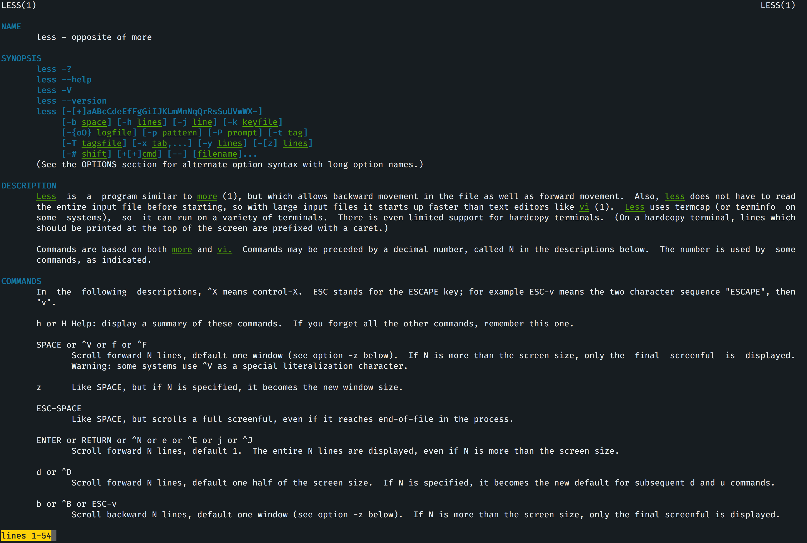

#### Colored Man Pages
> A plugin for the [fish-shell](https://fishshell.com).

[](/LICENSE)
[](https://fishshell.com)
[](https://www.github.com/oh-my-fish/oh-my-fish)

<br/>

This plugin installs a fish function wrapper around `man` that colorizes styled text (specifically underlined, bold, and standout) to make browsing man pages easier and more enjoyable. 

The colors are added by setting environment variables that control how `less`, `man`'s default pager, processes styled text. Why use a wrapper to prepare environment variables when the same thing could be achieved through environment variables initialized on shell startup? The reason is that the environment variables used are set to escape sequences that will "overflow" into the output of other commands reading environment variables. See this [Stackoverflow question](https://unix.stackexchange.com/questions/87261/getting-unexpected-colorized-output-on-several-commands). This idea was first inspired by [Arch Linux wiki](https://wiki.archlinux.org/index.php/Color_output_in_console#Using_less).



## Install

With [Oh My Fish]
```fish
$ omf install colored-man-pages
```
With [fisherman]
```fish
$ fisher patrickf3139/Colored-Man-Pages
```

## Usage
Just invoke `man` as usual, but without changing the pager, to get colored output. For example
```fish
$ man less
```
To execute vanilla `man` without colored output, we can bypass the wrapper using `command`. For example
```fish
$ command man less
```

# License

[MIT][mit] © [Patrick](https://github.com/patrickf3139)

[mit]: https://opensource.org/licenses/MIT
[omf-link]: https://www.github.com/oh-my-fish/oh-my-fish
[fisherman]: https://github.com/fisherman/fisherman
[Oh My Fish]: https://github.com/oh-my-fish/oh-my-fish
[license-badge]: https://img.shields.io/badge/license-MIT-007EC7.svg?style=flat-square
